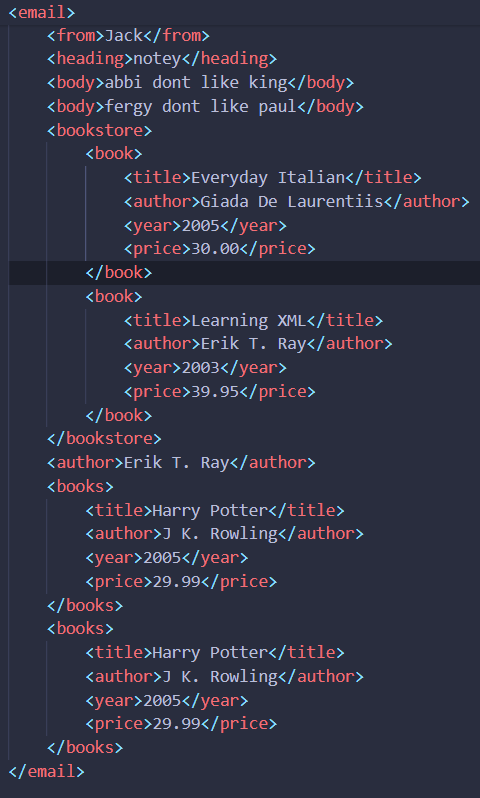
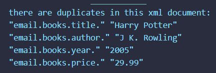

# XML Duplicate Finder

This extension locates duplicates in xml files and displays the duplicated xml nodes in the console.

## Features

This extension locates duplicates in xml files and displays the duplicated xml nodes in the console. Useful especially for huge xml or HTMl files and displays them in collapsed json format.

example:

GIven an xml file like this:

By running the command 'Activate extent' in the command pallette, the extension responds with this message in the debug console:

## Requirements

- vscode 1.78.0 and up
- macos, linux or windows
- npm

## Release Notes

### 1.0.0

Initial release of XML_WIZ:
This is my first extension. I made this to fix a personal and professional problem I kept having and to try my hand at something new. I will update and improve this as often as possible and especially if I missed something embarrassing.